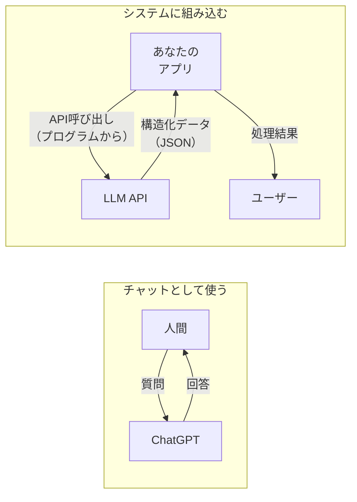
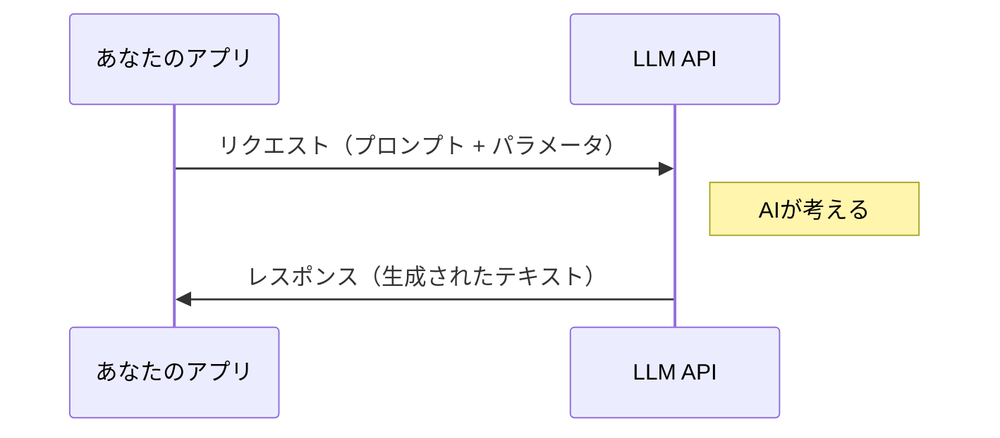
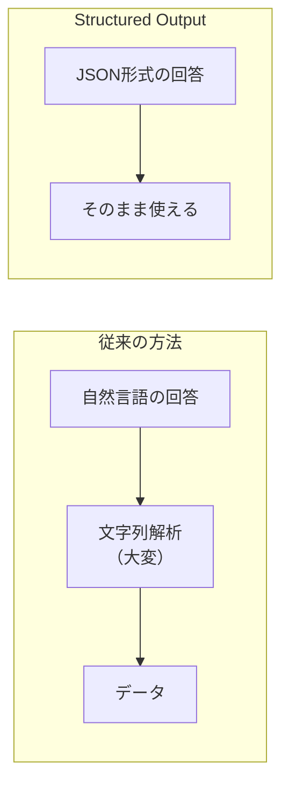
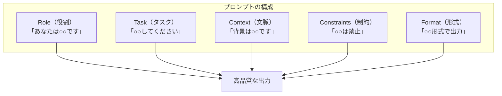
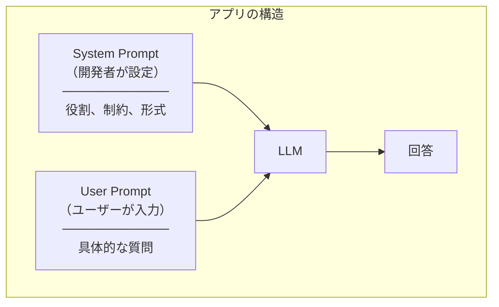
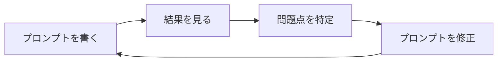

> **対応チェックリスト**: CI-5, CK-7, CJ-1〜3
> 

---

## はじめに

この章では、LLM（Large Language Model：大規模言語モデル）を**システムの一部として活用する**技術を学びます。

ChatGPTを「チャット相手」として使うのと、**アプリケーションに組み込む**のでは、必要な知識が違います。



---

## 1. LLM APIの基礎

### APIとは？

**API（Application Programming Interface）** は、プログラムから別のサービスを呼び出す仕組みです。

```
【日常の例え】
レストランで料理を注文する

あなた（アプリ） → 注文（リクエスト） → 厨房（API） → 料理（レスポンス）

「カレーライス1つ」と注文すると、カレーライスが出てくる
「ラーメン1つ、麺かため」と注文すると、かための麺のラーメンが出てくる
```

### LLM APIの基本構造

LLM APIは、**リクエスト**を送ると**レスポンス**が返ってきます。



### リクエストに含めるもの

| 項目 | 説明 | 例 |
| --- | --- | --- |
| **model** | 使用するモデル | `gpt-4`, `claude-3` |
| **messages** | 会話の履歴 | system, user, assistant |
| **temperature** | 創造性の度合い | 0.0〜2.0 |
| **max_tokens** | 出力の最大長 | 100, 500, 1000 |

### 重要なパラメータ：temperature

**temperature（温度）** は、AIの回答の「ばらつき」を制御します。

| 値 | 特徴 | 適した用途 |
| --- | --- | --- |
| **0.0** | 毎回同じ回答 | データ抽出、分類 |
| **0.5** | バランス型 | 一般的な質問応答 |
| **1.0以上** | 創造的・多様 | アイデア出し、物語作成 |

```
【例：「日本の首都は？」という質問】

temperature=0.0 → 「東京です」（毎回同じ）
temperature=1.5 → 「東京です！日本の政治・経済の中心地ですね」（毎回違う表現）
```

**日常に例えると**：
- temperature低い = 定型フォーマットの報告書
- temperature高い = ブレインストーミング

### 重要なパラメータ：max_tokens

**max_tokens** は、AIの回答の「最大文字数」を制限します。

```
【注意点】
max_tokensが小さすぎると、回答が途中で切れる

❌ 「日本の首都は東」  ← 切れてしまった
✅ 「日本の首都は東京です」
```

### エラーハンドリング

APIを呼び出すと、エラーが返ってくることがあります。

| エラーコード | 意味 | 対処法 |
| --- | --- | --- |
| **400** | リクエストが不正 | パラメータを確認 |
| **401** | 認証エラー | APIキーを確認 |
| **429** | レート制限 | 少し待ってリトライ |
| **500** | サーバーエラー | 少し待ってリトライ |

**429（レート制限）** は特に重要です。
短時間に大量のリクエストを送ると発生します。

```
【対策：指数バックオフ】
1回目失敗 → 1秒待ってリトライ
2回目失敗 → 2秒待ってリトライ
3回目失敗 → 4秒待ってリトライ
4回目失敗 → 8秒待ってリトライ
```

---

## 2. Structured Output（構造化出力）

### なぜ必要か？

AIの回答は、**自然言語（人間の言葉）** で返ってきます。
これをプログラムで処理するのは大変です。

```
【自然言語の回答】
「田中太郎さんは35歳で、メールアドレスはtanaka@example.comです」

→ プログラムで「名前」「年齢」「メール」を取り出すのは難しい
  （「さん」を除く？「歳」を除く？）
```

**Structured Output** を使うと、最初から「決まった形式」で回答を受け取れます。

```json
{
  "name": "田中太郎",
  "age": 35,
  "email": "tanaka@example.com"
}
```

### Structured Outputのメリット



| 観点 | 従来 | Structured Output |
| --- | --- | --- |
| 形式 | バラバラ | 統一 |
| 解析 | 複雑 | 簡単 |
| エラー | 起きやすい | 起きにくい |
| 信頼性 | 低い | 高い |

### JSON Schemaとは？

**JSON Schema** は、「どんなデータ構造を期待するか」を定義する仕様です。

```json
{
  "type": "object",
  "properties": {
    "name": { "type": "string" },
    "age": { "type": "number" },
    "email": { "type": "string" }
  },
  "required": ["name", "age", "email"]
}
```

これをLLMに渡すと、この形式に従った回答が返ってきます。

### 具体的な使用例

**タスク分解機能** を作る場合：

```
【入力】
「来週のプレゼン資料を作る」

【Structured Outputなし】
「まず、プレゼンの目的を明確にしましょう。次に、
ターゲットオーディエンスを特定します。そして...」

【Structured Outputあり】
{
  "tasks": [
    { "id": 1, "title": "プレゼンの目的を定義", "priority": "high" },
    { "id": 2, "title": "ターゲットを特定", "priority": "high" },
    { "id": 3, "title": "構成案を作成", "priority": "medium" },
    { "id": 4, "title": "スライド作成", "priority": "medium" },
    { "id": 5, "title": "リハーサル", "priority": "low" }
  ]
}
```

後者なら、そのままアプリのタスクリストに表示できます。

### 列挙型（Enum）の活用

「決まった選択肢の中から選ばせる」ことも可能です。

```json
{
  "status": {
    "type": "string",
    "enum": ["pending", "in_progress", "completed"]
  }
}
```

これにより、AIは `"pending"`, `"in_progress"`, `"completed"` のいずれかしか返さなくなります。
「進行中」「作業中」「やってる」のようなバラつきがなくなります。

---

## 3. プロンプト設計

### プロンプトとは？

**プロンプト** は、AIへの「指示書」です。
プログラミングでいう「コード」のようなものです。

```
【良いプロンプト】= 良い指示 = 良い出力
【悪いプロンプト】= 曖昧な指示 = 期待と違う出力
```

### 効果的なプロンプトの構成要素



### 各要素の詳細

### Role（役割）

AIに「どんな立場で回答するか」を指定します。

```
❌ 役割なし
「Pythonのコードをレビューしてください」

✅ 役割あり
「あなたは10年の経験を持つシニアPythonエンジニアです。
 Pythonのコードをレビューしてください」
```

役割を指定すると、AIはその視点で回答するようになります。

### Task（タスク）

「何をしてほしいか」を明確に伝えます。

```
❌ 曖昧
「このコードをいい感じにして」

✅ 明確
「このコードのパフォーマンスを改善してください。
 特に、ループ処理の効率化に注目してください」
```

### Context（文脈）

AIが知らない情報を補足します。

```
「以下の会議議事録に基づいて、次回のアジェンダ案を作成してください。

【会議議事録】
- 日時：2024年1月15日
- 参加者：田中、佐藤、山田
- 議題：新プロジェクトのキックオフ
- 決定事項：要件定義を2週間で完了する
- 次回課題：各自が担当範囲を整理する
」
```

### Constraints（制約）

「やってはいけないこと」「守るべきルール」を指定します。

```
「以下の制約を守ってください：
- 専門用語は使わない
- 200文字以内で回答する
- 推測で回答しない（分からなければ「不明」と回答）
」
```

### Format（形式）

出力の形を指定します。

```
「以下の形式で出力してください：

## 要約
（3行以内）

## 主なポイント
- ポイント1
- ポイント2
- ポイント3

## 次のアクション
（1行）
」
```

### System PromptとUser Prompt

LLM APIでは、2種類のプロンプトを使い分けます。

| 種類 | 誰が書くか | 内容 | 例 |
| --- | --- | --- | --- |
| **System Prompt** | 開発者 | AIの基本設定 | 「あなたはカスタマーサポートです」 |
| **User Prompt** | ユーザー | 個別の質問 | 「返品方法を教えて」 |



### プロンプトの反復改善

完璧なプロンプトを一発で書くのは難しいです。
**試して、改善する**サイクルを回しましょう。



**よくある改善パターン**：

| 問題 | 改善方法 |
| --- | --- |
| 回答が長すぎる | 「〇〇文字以内で」を追加 |
| 形式がバラバラ | 具体的な形式を指定 |
| 関係ない話をする | 制約を追加 |
| 推測で回答する | 「分からなければ不明と回答」を追加 |

---

## 4. 実践：タスク管理AIアシスタント

Sprint 1で作るアプリの「AIアシスタント機能」を例に、学んだことを統合します。

### 要件

- ユーザーがタスクを入力
- AIがタスクを分解して、優先度を提案
- 結果をタスクリストに表示

### System Prompt

```
あなたはタスク管理のエキスパートアシスタントです。

【役割】
ユーザーから受け取ったタスクを分析し、具体的なサブタスクに分解します。

【制約】
- サブタスクは3〜7個に分解してください
- 各タスクには優先度（high/medium/low）を付けてください
- 推測ではなく、入力されたタスクに基づいて分解してください
- 出力は必ず指定されたJSON形式で返してください

【出力形式】
{
  "original_task": "元のタスク",
  "subtasks": [
    { "id": 1, "title": "サブタスク名", "priority": "high/medium/low" }
  ]
}
```

### JSON Schema

```json
{
  "type": "object",
  "properties": {
    "original_task": { "type": "string" },
    "subtasks": {
      "type": "array",
      "items": {
        "type": "object",
        "properties": {
          "id": { "type": "number" },
          "title": { "type": "string" },
          "priority": {
            "type": "string",
            "enum": ["high", "medium", "low"]
          }
        },
        "required": ["id", "title", "priority"]
      }
    }
  },
  "required": ["original_task", "subtasks"]
}
```

### API呼び出しのイメージ

```jsx
const response = await openai.chat.completions.create({
  model: "gpt-4",
  temperature: 0.3,  // 一貫性重視
  messages: [
    { role: "system", content: systemPrompt },
    { role: "user", content: "来週のプレゼン資料を作る" }
  ],
  response_format: { type: "json_object" }
});

const result = JSON.parse(response.choices[0].message.content);
// → { original_task: "...", subtasks: [...] }
```

---

## まとめ

### 学んだことの要点

| トピック | 核心 | Sprint 1でやること |
| --- | --- | --- |
| **LLM API** | プログラムからAIを呼び出す | API呼び出しを実装 |
| **Structured Output** | 決まった形式で出力させる | JSONスキーマを定義 |
| **プロンプト設計** | 良い指示 = 良い出力 | System Promptを設計 |

### チェックリスト対応

| ID | タイトル | 本章での解説箇所 |
| --- | --- | --- |
| CI-5 | LLM API | 1章 |
| CK-7 | Structured Output | 2章 |
| CJ-1 | プロンプト基礎 | 3章 |
| CJ-2 | System Prompt設計 | 3章（System Prompt） |
| CJ-3 | 出力形式制御 | 2章、3章（Format） |

---

### 次のステップ

➡️ [04 AI駆動開発編：コンテキスト設計 / コード検証](https://www.notion.so/04-AI-2fd66af6e9318121bcdac0ff9b9494c2?pvs=21) へ進む