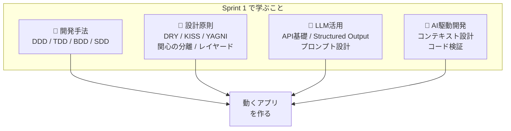
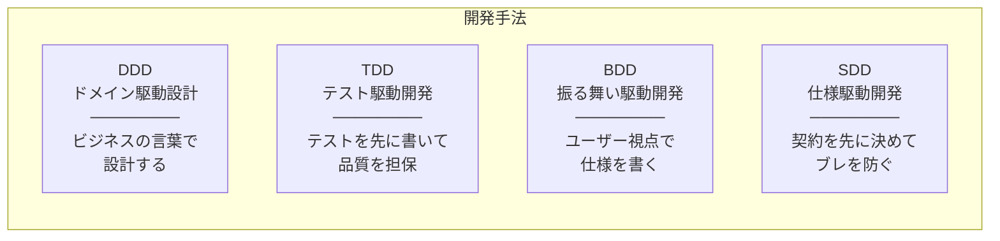
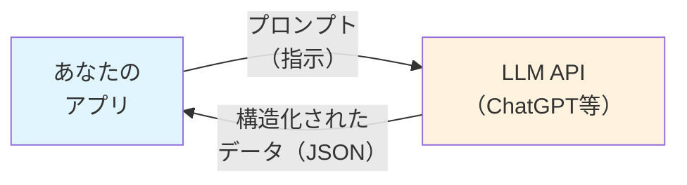
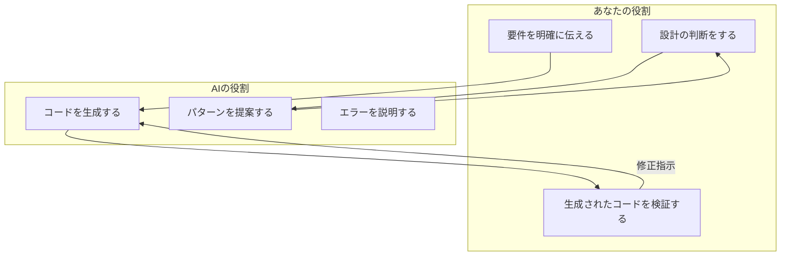
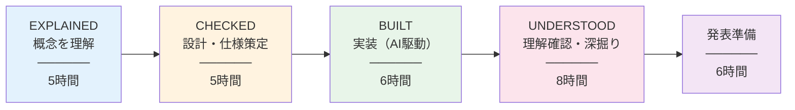

> **対象読者**: プログラミング未経験者
> 

---

## このドキュメントについて

本ドキュメントは、Road to Boost 研修の **Sprint 1** で学ぶ内容の全体像を解説します。

Sprint 1のテーマは「**AIと協働して、動くものを作れるようになる**」です。

プログラミングの経験がなくても大丈夫です。このSprintでは、AIの力を借りながら、実際に動くアプリケーションを作り上げます。そのために必要な「考え方」と「設計の原則」を身につけることが目標です。

---

## Sprint 1で目指すゴール

```
┌─────────────────────────────────────────────────────────────┐
│                   Sprint 1 の成果物イメージ                  │
│                                                             │
│   📋 タスク管理アプリ + AIアシスタント機能                    │
│                                                             │
│   ・タスクの作成・編集・削除・完了管理（CRUD）                │
│   ・AIによるタスク分解・優先度提案                           │
│   ・Vercel + Supabase でインターネット公開                   │
└─────────────────────────────────────────────────────────────┘
```

2週間後、あなたは「自分で設計し、AIと協力して実装した、動くWebアプリケーション」を持っています。

---

## 学ぶ内容の全体像

Sprint 1で学ぶ重点項目は、大きく4つの分野に分かれます。



### なぜこの4分野なのか？

| 分野 | 一言で言うと | 身近な例え |
| --- | --- | --- |
| **開発手法** | 「どうやって作るか」のプロセス | プロジェクトの進め方（段取り、手順） |
| **設計原則** | 「良い構造」のルール | 文書の構成ルール（結論ファースト、重複を避ける） |
| **LLM活用** | AIを「道具」として使う方法 | 新しいツールの使い方を覚える |
| **AI駆動開発** | AIと「協働」する方法 | 優秀なアシスタントへの指示の出し方 |

---

## 各分野の概要

### 1. 開発手法（DDD / TDD / BDD / SDD）

「4つのD」と覚えてください。これらは「ソフトウェアをどうやって作るか」のアプローチです。



**日常に例えると**:
- **DDD**: チームで「同じ言葉を同じ意味で使う」ルールを決める
- **TDD**: レポートを書く前に「どうなったら成功か」を定義する
- **BDD**: 「〇〇として、△△したい、なぜなら□□だから」形式でニーズを整理
- **SDD**: 作業範囲を先に決めてから作業を始める

➡️ 詳細は[01 開発手法編：DDD / TDD / BDD / SDD](https://www.notion.so/01-DDD-TDD-BDD-SDD-2fd66af6e931812a86b7e6997ec3e0a0?pvs=21) で解説

---

## 2. 設計原則（DRY / KISS / YAGNI / 関心の分離 / レイヤード）

「良いソフトウェア」と「悪いソフトウェア」を分けるルールです。

| 原則 | 意味 | 日常の例え |
| --- | --- | --- |
| **DRY** | Don’t Repeat Yourself（繰り返すな） | 同じ説明を資料の複数箇所にコピペしない |
| **KISS** | Keep It Simple, Stupid（シンプルに） | 複雑な図より、シンプルな図 |
| **YAGNI** | You Aren’t Gonna Need It（必要ないなら作るな） | 「念のため」のスライドは作らない |
| **関心の分離** | 役割ごとに分ける | 営業、企画、実行を別チームに |
| **レイヤード** | 層に分けて構造化 | 経営層→管理層→現場の階層構造 |

これらの原則を知っていると、AIが生成したコードの「良し悪し」を判断できるようになります。

➡️ 詳細は [02 設計原則編：DRY / KISS / YAGNI / 関心の分離 / レイヤード](https://www.notion.so/02-DRY-KISS-YAGNI-2fd66af6e93181b9b054e4dbaae40921?pvs=21) で解説

---

## 3. LLM活用（API基礎 / Structured Output / プロンプト設計）

AIを「ただのチャット相手」から「システムの一部」に昇格させる技術です。



**重要な概念**:
- **LLM API**: プログラムからAIを呼び出す方法（ボタン1つでAIに質問できる仕組み）
- **Structured Output**: AIの回答を「決まった形式」で返させる（JSONなど）
- **プロンプト設計**: AIへの指示を「上手に」書く技術

**なぜ重要か？**
「AIにお願いしたら、いい感じにやってくれた」では、ビジネスでは使えません。
「この形式で、この内容を、必ず返してくれる」という**再現性**が必要です。

➡️ 詳細は [03 LLM活用編：API基礎 / Structured Output / プロンプト設計](https://www.notion.so/03-LLM-API-Structured-Output-2fd66af6e93181afba3bda9d2e57ffbc?pvs=21) で解説

---

## 4. AI駆動開発（コンテキスト設計 / コード検証）

AIと協働してソフトウェアを作る「新しい働き方」です。



**AI駆動開発のポイント**:
1. **コンテキスト・エンジニアリング**: AIに「何を、なぜ、どう作りたいか」を正確に伝える
2. **生成コードの検証**: AIが作ったコードを「鵜呑みにしない」で検証する
3. **ハルシネーション対策**: AIの「自信満々な嘘」を見抜く

➡️ 詳細は[04 AI駆動開発編：コンテキスト設計 / コード検証](https://www.notion.so/04-AI-2fd66af6e9318121bcdac0ff9b9494c2?pvs=21) で解説

---

## 学習の流れ

Sprint 1は2週間（30時間）で、以下のフェーズを経ます。



### 各フェーズの説明

| フェーズ | 時間 | やること | ゴール |
| --- | --- | --- | --- |
| **EXPLAINED** | 5h | AIが概念を説明、全体像を把握 | 「なんとなく分かった」状態 |
| **CHECKED** | 5h | 要件定義、設計、チェックリスト確認 | 「何を作るか」が明確 |
| **BUILT** | 6h | AIと協働して実装 | 「動くもの」ができた |
| **UNDERSTOOD** | 8h | 質問応答、理解確認、応用検討 | 「なぜそうなるか」を説明できる |
| **発表準備** | 6h | 資料作成、リハーサル、発表会 | 他者に説明できる |

---

## 技術スタック

Sprint 1で使用する技術は以下の通りです。

| カテゴリ | 技術 | 役割 |
| --- | --- | --- |
| **フロントエンド** | Next.js 14（App Router） | Webページの見た目と動き |
| **バックエンド** | Next.js API Routes | データの処理（サーバー側） |
| **データベース** | Supabase（PostgreSQL） | データの保存場所 |
| **LLM** | Open Responses API | AIの頭脳 |
| **デプロイ** | Vercel + Supabase | インターネットへの公開 |
| **開発環境** | Cursor、Git/GitHub | コードを書く・管理する場所 |

「全部覚えなきゃ」と思わなくて大丈夫です。AIが使い方を教えてくれます。

---

## 発表で説明すること

Sprint 1の最後に、15〜20分の発表会があります。以下を説明できることが目標です。

1. **何を作ったか**（デモ）
2. **仕様駆動設計（SDD）の実践**
3. **採用した設計原則と理由**（DRY/KISS/関心の分離）
4. **レイヤー構成とその意図**
5. **Structured Outputの活用とその利点**
6. **AIとどう協働したか**
7. **次のSprintで深化させたいこと**

「作った」だけでなく、「なぜそう作ったか」を説明できることが重要です。

---

## 補足情報

### このガイドに含まれないもの

Sprint 1のチェックリストには全232項目がありますが、この重点ガイドでは約30項目を深掘りしています。残りの項目は以下のドキュメントで一覧化しています。

➡️[05 補足項目一覧：Sprint 1で詳細解説しなかった項目](https://www.notion.so/05-Sprint-1-2fd66af6e9318122bdc0e3536da2592f?pvs=21) （補足項目一覧）

---

## まとめ

Sprint 1で身につけること：

```
┌────────────────────────────────────────────────────────────────┐
│  ✅ ビジネスの言葉で設計する（DDD）                              │
│  ✅ 品質を担保する考え方を持つ（TDD/BDD）                        │
│  ✅ 仕様を先に決める習慣をつける（SDD）                          │
│  ✅ シンプルで保守しやすいコードの原則を知る（DRY/KISS/YAGNI）    │
│  ✅ AIを「システムの一部」として使える（LLM API/Structured Output）│
│  ✅ AIと協働して、動くものを作れる                               │
└────────────────────────────────────────────────────────────────┘
```

さあ、始めましょう！