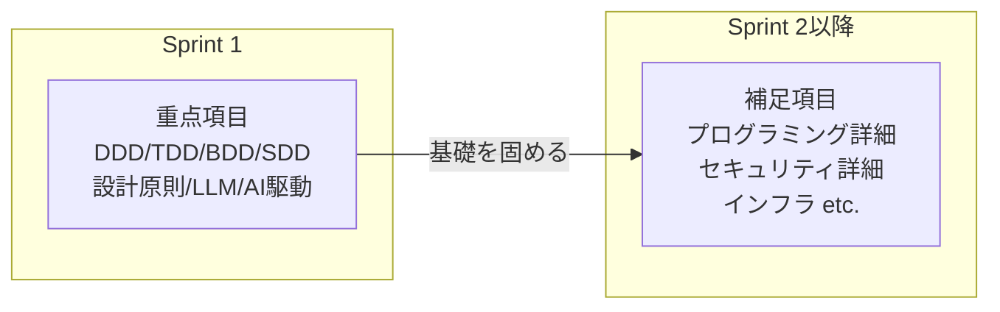

## このドキュメントについて

Sprint 1のチェックリストには**全232項目**があります。

本ガイドの重点解説ドキュメント（01〜04）では、Sprint 1の**核となる約30項目**を深掘りしました。

このドキュメントでは、**詳細解説しなかった残りの項目**を一覧化し、以下を整理します。

- 各項目の概要（1〜2行）
- Sprint 1での到達レベル
- 深掘りするSprint（将来）

---

## なぜこれらは「補足」なのか？

Sprint 1のテーマは**「AIと協働して、動くものを作れるようになる」** です。

補足項目は重要ですが、Sprint 1では**「存在を知る（CHECKED）」レベルで十分**であり、Sprint 2以降で深く学びます。



---

## 重点解説した項目（まとめ）

以下は、本ガイドで詳細に解説した項目です。

| カテゴリ | 項目ID | 解説ドキュメント |
| --- | --- | --- |
| コンテキスト・エンジニアリング | AA-1〜3 | [04_ai_driven_development.md](./04_ai_driven_development.md) |
| AI生成コードの検証 | AB-1〜3 | [04_ai_driven_development.md](./04_ai_driven_development.md) |
| DDD（ドメイン駆動設計） | T-1 | [01_development_methods.md](./01_development_methods.md) |
| TDD（テスト駆動開発） | U-1, U-2 | [01_development_methods.md](./01_development_methods.md) |
| BDD（振る舞い駆動開発） | V-1 | [01_development_methods.md](./01_development_methods.md) |
| SDD（仕様駆動開発） | W-1 | [01_development_methods.md](./01_development_methods.md) |
| DRY・KISS・YAGNI | AK-2 | [02_design_principles.md](./02_design_principles.md) |
| 関心の分離 | AK-3 | [02_design_principles.md](./02_design_principles.md) |
| レイヤードアーキテクチャ | AL-1 | [02_design_principles.md](./02_design_principles.md) |
| LLM API | CI-5 | [03_llm_fundamentals.md](./03_llm_fundamentals.md) |
| プロンプト設計 | CJ-1〜3 | [03_llm_fundamentals.md](./03_llm_fundamentals.md) |
| Structured Output | CK-7 | [03_llm_fundamentals.md](./03_llm_fundamentals.md) |

---

## 補足項目一覧

### プログラミング基礎（E〜I）

Sprint 1では実践を通じて触れますが、深い理解はSprint 2以降で。

| ID | タイトル | 概要 | Sprint 1での役割 |
| --- | --- | --- | --- |
| **E-1** | 基本構文 | 変数、条件分岐、ループ | AIが生成したコードを読むために必要 |
| **E-1** | 入力検証 | バリデーション、境界条件 | コードレビュー時に確認 |
| **F-1** | オブジェクト指向 | クラス、継承、カプセル化 | Sprint 2で詳しく |
| **F-2** | 関数型プログラミング | 純粋関数、副作用 | Sprint 2で詳しく |
| **G-1〜** | 応用概念 | 非同期処理、メモリ管理 | Sprint 2以降で詳しく |
| **H-1〜** | デザインパターン | Singleton、Factory、Observer等 | Sprint 2以降で詳しく |
| **I-1〜** | クリーンコード | 命名規則、リファクタリング | Sprint 2で詳しく |

### 開発環境・ツール（J〜L）

Sprint 0で基本セットアップ済み。Sprint 1では使いながら慣れる。

| ID | タイトル | 概要 | Sprint 1での役割 |
| --- | --- | --- | --- |
| **J-1〜** | 開発環境構築 | エディタ、ターミナル、デバッガ | Sprint 0で完了 |
| **K-1〜** | パッケージ管理 | npm, pip, 依存関係 | 使いながら学ぶ |
| **L-1〜** | バージョン管理 | Git, GitHub, ブランチ | 使いながら学ぶ |

### その他の開発手法（X〜Z）

Sprint 1で触れる手法以外。

| ID | タイトル | 概要 | Sprint 1での役割 |
| --- | --- | --- | --- |
| **X-1〜** | アジャイル、スクラム | 開発プロセス管理 | 背景知識として |
| **Y-1〜** | AI駆動開発の原則 | AIとの協働原則 | 04で触れた内容の補足 |
| **Z-1〜** | AIツール活用 | Cursor, Copilot等 | 使いながら学ぶ |

### 要件定義・企画（AC〜AG）

Sprint 1では簡易的に実施。Sprint 4で本格的に。

| ID | タイトル | 概要 | Sprint 1での役割 |
| --- | --- | --- | --- |
| **AC-1〜** | 要件定義 | ユーザーストーリー、優先度 | 簡易版を実施 |
| **AD-1〜** | ユーザーリサーチ | ペルソナ、インタビュー | Sprint 4で本格化 |
| **AE-1〜** | 企画・発見手法 | ブレインストーミング | Sprint 4で本格化 |
| **AF-1〜** | プロトタイピング | ワイヤーフレーム、モックアップ | Sprint 4で本格化 |
| **AG-1〜** | UX設計 | ユーザビリティ、アクセシビリティ | Sprint 4で本格化 |

### 設計・アーキテクチャ（AL, AM, AN）

Sprint 1ではレイヤードの基礎のみ。

| ID | タイトル | 概要 | Sprint 1での役割 |
| --- | --- | --- | --- |
| **AL-2〜** | クリーンアーキテクチャ | 依存性逆転、ヘキサゴナル | Sprint 2で詳しく |
| **AL-6〜** | 分散システム設計 | マイクロサービス、CAP定理 | Sprint 3で触れる |
| **AM-1〜** | データ設計 | 正規化、ER図 | Sprint 2で詳しく |
| **AN-1〜** | API設計 | REST, OpenAPI | Sprint 1で簡易版、Sprint 2で本格化 |

### フロントエンド（AP〜AT）

Sprint 1ではNext.jsを使いながら学ぶ。

| ID | タイトル | 概要 | Sprint 1での役割 |
| --- | --- | --- | --- |
| **AP-1〜** | Web標準技術 | HTML, CSS, JavaScript | 使いながら学ぶ |
| **AQ-1〜** | CSSアーキテクチャ | Tailwind, CSS設計 | 使いながら学ぶ |
| **AR-1〜** | UIフレームワーク | React, Next.js | Sprint 1の実装で使用 |
| **AS-1〜** | パフォーマンス | Core Web Vitals | Sprint 3で詳しく |
| **AT-1〜** | モバイル対応 | レスポンシブ、PWA | Sprint 3以降 |

### バックエンド（AU〜AX）

Sprint 1ではNext.js API Routesを使用。Sprint 2でFastAPIへ。

| ID | タイトル | 概要 | Sprint 1での役割 |
| --- | --- | --- | --- |
| **AU-1〜** | サーバーサイド処理 | リクエスト/レスポンス | 使いながら学ぶ |
| **AV-1〜** | API実装 | エンドポイント設計 | Sprint 1で簡易版 |
| **AW-1〜** | 非同期処理 | バックグラウンドジョブ | Sprint 2以降 |
| **AX-1〜** | サーバーレス | Lambda, Edge Functions | Sprint 3で触れる |

### データベース（AY〜BC）

Sprint 1ではSupabaseを使用。Sprint 2でPostgreSQLを詳しく。

| ID | タイトル | 概要 | Sprint 1での役割 |
| --- | --- | --- | --- |
| **AY-1〜** | RDB基礎 | SQL, テーブル設計 | Supabaseで簡易的に |
| **AZ-1〜** | NoSQL | MongoDB, Redis | Sprint 2以降 |
| **BA-1〜** | データモデリング | ER図、正規化 | Sprint 2で詳しく |
| **BB-1〜** | トランザクション | ACID, 整合性 | Sprint 2で詳しく |
| **BC-1〜** | キャッシュ | Redis, メモリキャッシュ | Sprint 3以降 |

### メッセージング・リアルタイム（BD〜BG）

Sprint 2以降で学ぶ領域。

| ID | タイトル | 概要 | Sprint 1での役割 |
| --- | --- | --- | --- |
| **BD-1〜** | メッセージキュー | RabbitMQ, SQS | Sprint 3以降 |
| **BE-1〜** | イベント駆動 | Pub/Sub, Kafka | Sprint 3以降 |
| **BF-1〜** | リアルタイム通信 | WebSocket, SSE | Sprint 3以降 |
| **BG-1〜** | 外部API連携 | OAuth, Webhook | Sprint 2で触れる |

### セキュリティ（BI〜BK）

Sprint 2で本格的に学ぶ。Sprint 1ではAB-3で基礎を押さえる。

| ID | タイトル | 概要 | Sprint 1での役割 |
| --- | --- | --- | --- |
| **BI-1〜** | OWASP Top 10 | 主要な脆弱性 | Sprint 2で詳しく |
| **BJ-1〜** | 認証・認可 | JWT, OAuth | Sprint 2で詳しく |
| **BK-1〜** | コンプライアンス | GDPR, 監査 | Sprint 3以降 |

### テスト・品質（BN）

Sprint 1ではTDDの考え方を学ぶ。Sprint 2で実践。

| ID | タイトル | 概要 | Sprint 1での役割 |
| --- | --- | --- | --- |
| **BN-1〜** | テスト実装 | ユニット、統合、E2E | Sprint 2で本格化 |

### インフラ・運用（BR〜BY）

Sprint 2でDocker、Sprint 3でAWS/Terraformを学ぶ。

| ID | タイトル | 概要 | Sprint 1での役割 |
| --- | --- | --- | --- |
| **BR-1〜** | Docker | コンテナ、Docker Compose | Sprint 2で詳しく |
| **BU-1〜** | Terraform/IaC | インフラのコード化 | Sprint 3で詳しく |
| **BW-1〜** | CI/CD | GitHub Actions | Sprint 3で詳しく |
| **BY-1〜** | 監視・ログ | CloudWatch, Sentry | Sprint 3で詳しく |

### LLM応用（CI, CK, CL, CM, CN）

Sprint 1では基礎のみ。Sprint 2でRAG、Sprint 3でAgentを学ぶ。

| ID | タイトル | 概要 | Sprint 1での役割 |
| --- | --- | --- | --- |
| **CI-1〜4** | LLM基礎（API以外） | トークン、コンテキスト | 背景知識として |
| **CK-1〜6** | LLMアプリ構築 | Function Calling等 | Sprint 2以降 |
| **CL-1〜** | RAG | 検索拡張生成、FAISS | Sprint 2で詳しく |
| **CM-1〜** | Agent | 自律エージェント、ReAct | Sprint 3で詳しく |
| **CN-1〜** | LLM運用・評価 | 評価指標、A/Bテスト | Sprint 3以降 |

### CS基礎（A〜D）

コンピュータサイエンスの基礎。必要に応じて参照。

| ID | タイトル | 概要 | Sprint 1での役割 |
| --- | --- | --- | --- |
| **A-1〜** | コンピュータの仕組み | CPU、メモリ、OS | 背景知識として |
| **B-1〜** | データ構造とアルゴリズム | 配列、ハッシュ、計算量 | 必要に応じて参照 |
| **C-1〜** | ネットワーク基礎 | HTTP, DNS, TCP/IP | 背景知識として |
| **D-1〜** | 分散システム基礎 | CAP定理、一貫性 | Sprint 3で触れる |

---

## Sprint別の学習計画

| Sprint | 新たに深掘りする領域 |
| --- | --- |
| **Sprint 1** | DDD/TDD/BDD/SDD、設計原則、LLM基礎、AI駆動開発 |
| **Sprint 2** | フロント/バック分離、Docker、JWT認証、RAG、TDD実践 |
| **Sprint 3** | AWS、Terraform、CI/CD、Agent、監視 |
| **Sprint 4** | 全領域の統合、自走、品質向上 |

---

## 学習のアドバイス

### Sprint 1での心構え

```
┌─────────────────────────────────────────────────────┐
│  補足項目の扱い方                                    │
│                                                     │
│  ✅ 「存在を知る」レベルでOK                         │
│     → 「こういう概念があるんだな」程度               │
│                                                     │
│  ✅ 実装中に出てきたら調べる                         │
│     → AIに聞きながら進める                          │
│                                                     │
│  ✅ 深掘りは後のSprintで                            │
│     → 今は重点項目に集中                            │
│                                                     │
│  ❌ 全部理解しようとしない                          │
│     → 完璧主義は学習の敵                            │
└─────────────────────────────────────────────────────┘
```

### 「分からない」への対処法

1. **AIに聞く**：「〇〇とは何ですか？初学者向けに説明してください」
2. **動かしてみる**：理論より実践。動かすと分かることが多い
3. **後回しにする**：今分からなくても、後で分かることも多い

---

## 参考：チェックリストの全体構造

Sprint 1のチェックリストは、以下の大カテゴリで構成されています。

| 大カテゴリ | 項目数（概算） | Sprint 1での重要度 |
| --- | --- | --- |
| Ⅵ. AI駆動開発 | 約30 | ★★★ 重点 |
| Ⅱ. プログラミング | 約50 | ★★ 実践で触れる |
| Ⅲ. ソフトウェア工学 | 約30 | ★★★ 重点（開発手法） |
| Ⅲ-2. 設計・アーキテクチャ | 約40 | ★★★ 重点（設計原則） |
| Ⅳ. Web開発 | 約50 | ★★ 実践で触れる |
| Ⅴ. LLM・生成AI | 約30 | ★★★ 重点 |
| Ⅰ. CS基礎 | 約15 | ★ 背景知識 |

---

### 次のステップ

これでSprint 1の重点ガイドは完了です。

学習の流れ：
1.[Sprint 1 全体概要](https://www.notion.so/Sprint-1-2fd66af6e9318188b28ce5f834b555f6?pvs=21) で全体像を把握
2.[01 開発手法編：DDD / TDD / BDD / SDD](https://www.notion.so/01-DDD-TDD-BDD-SDD-2fd66af6e931812a86b7e6997ec3e0a0?pvs=21) で開発手法を学ぶ
3.[02 設計原則編：DRY / KISS / YAGNI / 関心の分離 / レイヤード](https://www.notion.so/02-DRY-KISS-YAGNI-2fd66af6e93181b9b054e4dbaae40921?pvs=21) で設計原則を学ぶ
4.[03 LLM活用編：API基礎 / Structured Output / プロンプト設計](https://www.notion.so/03-LLM-API-Structured-Output-2fd66af6e93181afba3bda9d2e57ffbc?pvs=21) でLLM活用を学ぶ
5.[04 AI駆動開発編：コンテキスト設計 / コード検証](https://www.notion.so/04-AI-2fd66af6e9318121bcdac0ff9b9494c2?pvs=21) でAI駆動開発を学ぶ
6. **実際に手を動かして、タスク管理アプリを作る！**

---