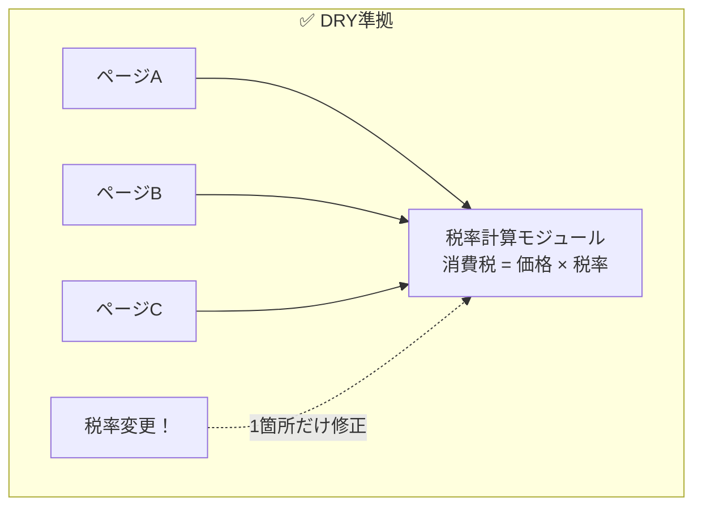
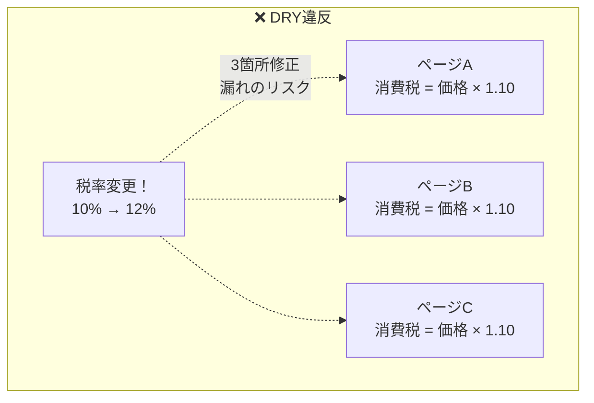
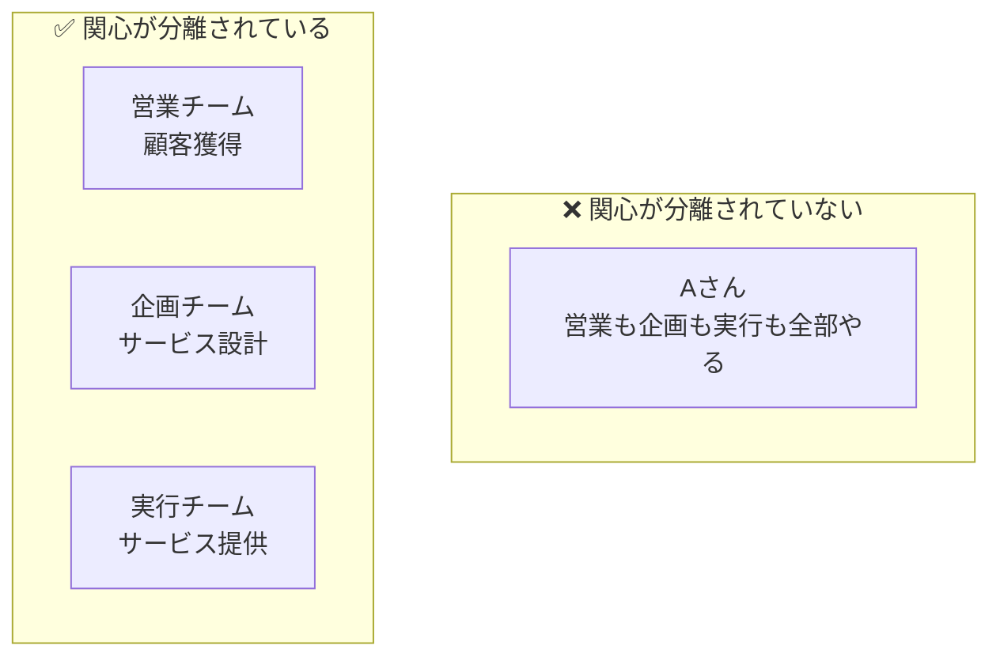
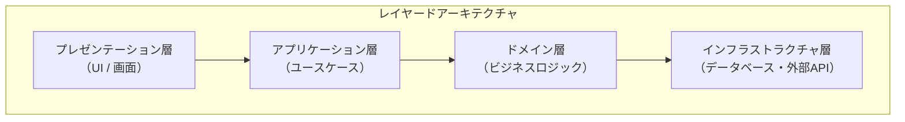
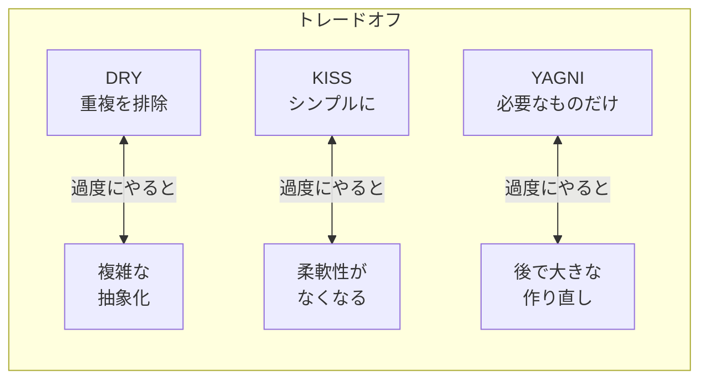

> **読了目安**: 約15分
**対応チェックリスト**: AK-2, AK-3, AL-1
> 

---

## はじめに

この章では、「良いソフトウェア」と「悪いソフトウェア」を分ける**設計原則**を学びます。

これらの原則を知っていると：
- AIが生成したコードの「良し悪し」を判断できる
- 「なぜこう作ったのか」を説明できる
- 保守しやすい（後から修正しやすい）コードが書ける

---

## 1. DRY原則（Don’t Repeat Yourself）

### 一言で言うと

**「同じことを2回書くな」**

### なぜ重要か？

同じコードがあちこちにあると、修正するときに全部直さなければなりません。
1箇所直し忘れると、バグになります。





### 身近な例え

資料で、会社概要を5箇所にコピペしていませんか？
会社名が変わったら、5箇所全部直す必要があります。
1箇所にまとめて、他は参照するようにしましょう。

### 具体例

**❌ DRY違反**

```jsx
// ページA
const taxA = price * 1.10;

// ページB
const taxB = price * 1.10;

// ページC（間違えて1.08になってる！）
const taxC = price * 1.08;
```

**✅ DRY準拠**

```jsx
// 税率は1箇所で管理
const TAX_RATE = 1.10;

// どこからでも同じ計算
const calculateTax = (price) => price * TAX_RATE;
```

### 注意点：過度なDRYは危険

「似ているから共通化しよう」と安易に考えると、逆に問題が起きることも。

```
【危険な例】
「ユーザーの住所」と「配送先の住所」が似ているので共通化
→ 後から「配送先だけ建物名が必要」となったとき、分離が大変
```

**本当に同じ「知識」かどうか**を見極めることが大切です。

---

## 2. KISS原則（Keep It Simple, Stupid）

### 一言で言うと

**「シンプルにしておけ」**

### なぜ重要か？

複雑なコードは：
- 読むのに時間がかかる
- バグが潜みやすい
- 修正するのが怖い

シンプルなコードは：
- すぐ理解できる
- バグが見つけやすい
- 安心して修正できる

### 身近な例え

```
【複雑な説明】
「本施策は、市場環境の変化に伴う競争優位性の確保を目的とし、
 顧客接点の最適化を通じた収益基盤の強化を図るものである」

【シンプルな説明】
「お客様と接する機会を増やして、売上を上げます」
```

どちらが伝わりますか？

### 具体例

**❌ KISS違反（賢いけど読めない）**

```jsx
// 1行で書けるけど、何をしているか分からない
const result = data.filter(x => x.active).map(x => x.value).reduce((a, b) => a + b, 0) / data.filter(x => x.active).length;
```

**✅ KISS準拠（誰でも読める）**

```jsx
// 何をしているか明確
const activeItems = data.filter(item => item.active);
const values = activeItems.map(item => item.value);
const total = values.reduce((sum, value) => sum + value, 0);
const average = total / activeItems.length;
```

### 「賢いコード」より「読めるコード」

```
エンジニアの格言：

「コードは書く時間より、読む時間の方が10倍長い」
「6ヶ月後の自分は他人」
```

---

## 3. YAGNI原則（You Aren’t Gonna Need It）

### 一言で言うと

**「今必要ないものは作るな」**

### なぜ重要か？

「将来使うかもしれないから、先に作っておこう」

この考えは危険です。なぜなら：
- 予測は外れることが多い
- 使われないコードも保守が必要
- システムが複雑になる

### 身近な例え

```
【YAGNI違反】
「念のため」でスライドを30枚用意
→ 実際に使ったのは10枚だけ
→ 残り20枚の作成時間は無駄

【YAGNI準拠】
必要な10枚だけ作成
→ 質問されたら、その場で補足資料を見せる
```

### 具体例

**❌ YAGNI違反**

```jsx
// 「将来、複数言語対応するかもしれない」と考えて
const getMessage = (key, language = 'ja') => {
  const messages = {
    ja: { greeting: 'こんにちは', farewell: 'さようなら' },
    en: { greeting: 'Hello', farewell: 'Goodbye' },
    zh: { greeting: '你好', farewell: '再见' },
    // ... 10言語分用意
  };
  return messages[language][key];
};

// 実際には日本語しか使わなかった...
```

**✅ YAGNI準拠**

```jsx
// 今は日本語だけ
const getMessage = (key) => {
  const messages = {
    greeting: 'こんにちは',
    farewell: 'さようなら'
  };
  return messages[key];
};

// 多言語が必要になったら、そのとき対応する
```

### 注意点：拡張性とのバランス

YAGNIは「設計を雑にしていい」という意味ではありません。
「今必要な機能」を「後から拡張しやすい形」で作ることが大切です。

---

## 4. 関心の分離（Separation of Concerns）

### 一言で言うと

**「役割ごとに分ける」**

### なぜ重要か？

全部が1つにまとまっていると：
- どこを直せばいいか分からない
- 1箇所の変更が全体に影響する
- チームで分担できない

役割ごとに分けると：
- 担当箇所が明確
- 変更の影響が限定的
- 並行して作業できる

### 身近な例え



### ソフトウェアでの具体例

Webアプリケーションは通常、3つの「関心」に分けられます。

| 関心 | 役割 | 例 |
| --- | --- | --- |
| **表示（UI）** | 画面に何を見せるか | ボタン、フォーム、色 |
| **ロジック** | どう処理するか | 計算、判定、変換 |
| **データ** | どこから取得するか | データベース、API |

**❌ 関心が混在**

```jsx
// 1つの関数に全部入っている
function showUserProfile() {
  // データ取得（データの関心）
  const response = fetch('/api/user/1');
  const user = response.json();

  // 計算（ロジックの関心）
  const age = calculateAge(user.birthday);
  const isAdult = age >= 18;

  // 表示（UIの関心）
  document.getElementById('name').innerHTML = user.name;
  document.getElementById('age').innerHTML = age + '歳';
  if (isAdult) {
    document.getElementById('badge').style.display = 'block';
  }
}
```

**✅ 関心を分離**

```jsx
// データ取得（データの関心）
async function fetchUser(id) {
  const response = await fetch(`/api/user/${id}`);
  return response.json();
}

// 計算（ロジックの関心）
function calculateUserDisplay(user) {
  const age = calculateAge(user.birthday);
  return {
    name: user.name,
    age: age,
    isAdult: age >= 18
  };
}

// 表示（UIの関心）
function renderUserProfile(displayData) {
  document.getElementById('name').innerHTML = displayData.name;
  document.getElementById('age').innerHTML = displayData.age + '歳';
  // ...
}

// 組み合わせて使う
async function showUserProfile() {
  const user = await fetchUser(1);
  const displayData = calculateUserDisplay(user);
  renderUserProfile(displayData);
}
```

---

## 5. レイヤードアーキテクチャ

### 一言で言うと

**「層に分けて積み重ねる」**

### 関心の分離をシステム全体に適用

「関心の分離」をシステム全体に適用すると、「レイヤードアーキテクチャ」になります。



### 各層の役割

| 層 | 役割 | 具体例 |
| --- | --- | --- |
| **プレゼンテーション層** | ユーザーとのやり取り | ボタン、フォーム、画面表示 |
| **アプリケーション層** | 処理の流れを制御 | 「ログインする」「商品を注文する」 |
| **ドメイン層** | ビジネスルール | 「在庫不足なら注文不可」 |
| **インフラストラクチャ層** | 技術的な詳細 | データベース接続、API呼び出し |

### 身近な例え

```
【会社の組織構造】

経営層（プレゼンテーション層）
  → 外部（顧客・株主）とのやり取り

管理層（アプリケーション層）
  → 業務フローの管理

実務層（ドメイン層）
  → 実際の業務遂行

IT・総務（インフラストラクチャ層）
  → 基盤の提供（システム、備品）
```

### 依存の方向

重要なルール：**上の層は下の層に依存する。下の層は上の層を知らない。**

```
✅ OK: 画面が「注文処理」を呼び出す
❌ NG: データベースが「画面」を呼び出す
```

これにより：
- 画面のデザインを変えても、ビジネスロジックは影響を受けない
- データベースを変えても、画面は影響を受けない

### メリットとデメリット

| メリット | デメリット |
| --- | --- |
| 役割が明確 | 小規模だと過剰設計 |
| テストしやすい | ファイルが増える |
| チーム分担しやすい | 層をまたぐ変更が手間 |

---

## 原則のトレードオフ

### 原則は「絶対」ではない

これらの原則は、**盲目的に適用すると逆効果**になることがあります。



### 判断の基準

| 状況 | 優先する原則 |
| --- | --- |
| プロトタイプ・検証段階 | YAGNI（まず動くものを） |
| 長期運用するシステム | DRY、関心の分離（保守性重視） |
| 初学者が多いチーム | KISS（読みやすさ重視） |

**「なぜこの原則を適用したか」を説明できることが大切です。**

---

## Sprint 1での実践

### やってみること

1. **DRY**: 重複しているコードを見つけて、1箇所にまとめる
2. **KISS**: 複雑な処理を、シンプルな形に書き直す
3. **YAGNI**: 「将来のため」のコードを削除する
4. **関心の分離**: UI・ロジック・データを分けて書く
5. **レイヤード**: Controller → Service → Repository の構造を作る

### AIが生成したコードをレビューするときの観点

| 観点 | 質問 |
| --- | --- |
| DRY | 同じコードが複数箇所にないか？ |
| KISS | もっとシンプルに書けないか？ |
| YAGNI | 今使わない機能が含まれていないか？ |
| 関心の分離 | 1つの関数に複数の役割が混ざっていないか？ |

---

## まとめ

### 5つの原則の要点

| 原則 | 核心 | 一言アドバイス |
| --- | --- | --- |
| **DRY** | 重複を避ける | 「同じコード2回目」で共通化を検討 |
| **KISS** | シンプルに | 「6ヶ月後の自分が読める？」と自問 |
| **YAGNI** | 必要なものだけ | 「今使う？」Noなら作らない |
| **関心の分離** | 役割ごとに分ける | UI・ロジック・データは別々に |
| **レイヤード** | 層に分ける | 依存は上から下への一方通行 |

### チェックリスト対応

| ID | タイトル | 本章での解説箇所 |
| --- | --- | --- |
| AK-2 | DRY・KISS・YAGNI | 1〜3章 |
| AK-3 | 関心の分離 | 4章 |
| AL-1 | レイヤードアーキテクチャ | 5章 |

---

### 次のステップ

➡️ [03 LLM活用編：API基礎 / Structured Output / プロンプト設計](https://www.notion.so/03-LLM-API-Structured-Output-2fd66af6e93181afba3bda9d2e57ffbc?pvs=21) へ進む