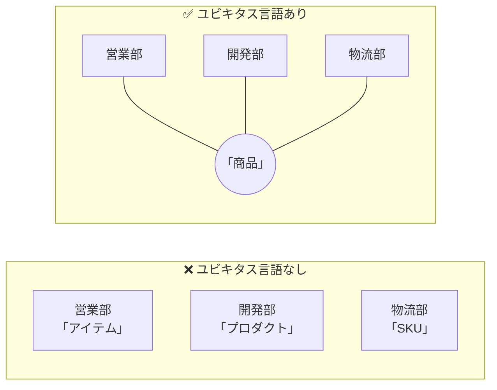
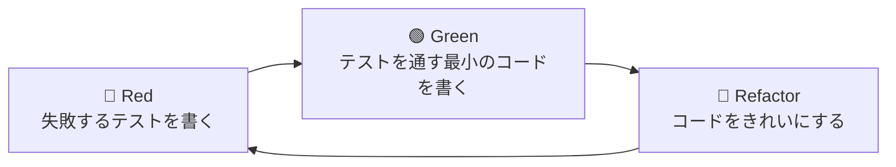
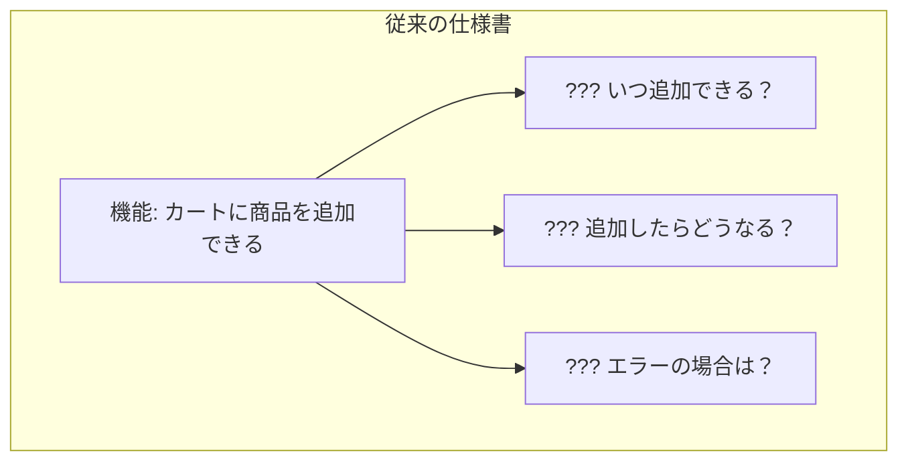
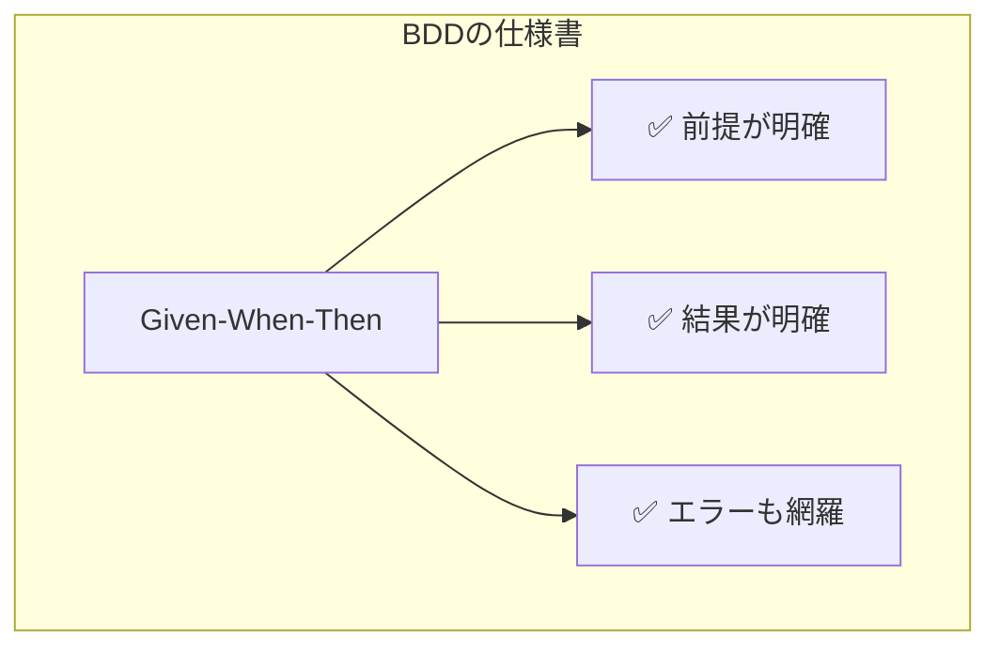
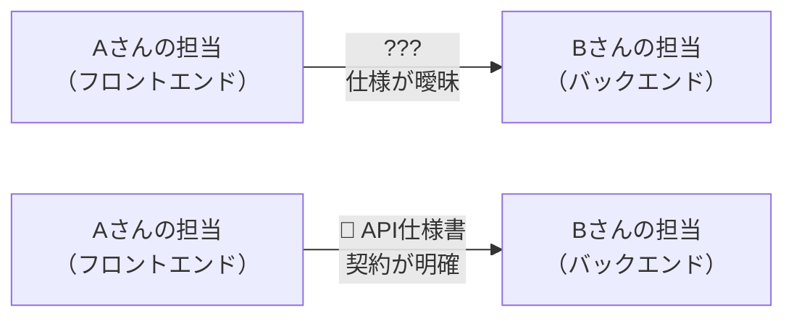
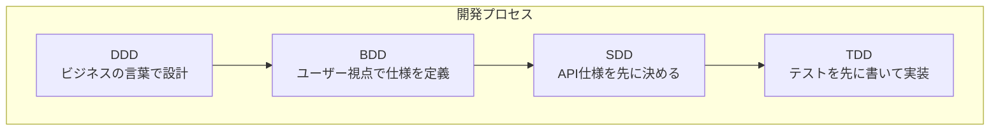

> **対応チェックリスト**: T-1, U-1, U-2, V-1, W-1
> 

## はじめに

この章では、ソフトウェア開発における4つの重要な「手法」を学びます。

- **DDD**（Domain-Driven Design）: ドメイン駆動設計
- **TDD**（Test-Driven Development）: テスト駆動開発
- **BDD**（Behavior-Driven Development）: 振る舞い駆動開発
- **SDD**（Specification-Driven Development）: 仕様駆動開発

これらは「コードの書き方」ではなく、「ソフトウェアをどう作るか」という**プロセスと考え方**です。

---

## 1. DDD（ドメイン駆動設計）

### 一言で言うと

**「ビジネスの言葉で、ビジネスの問題を解決するソフトウェアを作る」**

### なぜ重要か？

ソフトウェア開発で最も難しいのは、実は「プログラミング」ではありません。
**「何を作るべきか」を正しく理解すること**です。

よくある失敗パターン：

```
クライアント：「商品の在庫を管理したい」
開発者：「了解！在庫管理システム作ります！」
（3ヶ月後）
開発者：「できました！」
クライアント：「えっ、これじゃない...」
```

DDDは、この「認識のズレ」を防ぐためのアプローチです。

### 核となる概念

### ユビキタス言語（Ubiquitous Language）

**「全員が同じ言葉を、同じ意味で使う」** というルールです。



**身近な例え**：
チームで「ステークホルダー」という言葉を使うとき、全員が同じ定義を共有していますか？ある人は「経営層」、別の人は「顧客」、また別の人は「関係者全員」と解釈しているかもしれません。DDDでは、最初にこれを統一します。

### ドメインモデル（Domain Model）

**「ビジネスルールを、そのままコードにする」** という考え方です。

例：銀行口座

```
【ビジネスルール】
- 残高がマイナスになる引き出しはできない
- 1日の引き出し上限は50万円

【DDDなしのコード】
残高 = 残高 - 引き出し額  ← ルールがどこにもない！

【DDDありのコード】
口座.引き出し(金額)
  → 「残高不足」なら拒否
  → 「上限超過」なら拒否
  → OKなら残高を減らす
```

ビジネスルールが「口座」というモデル自身に組み込まれているので、ルール違反が起きにくくなります。

### 境界づけられたコンテキスト

**「同じ言葉でも、文脈によって意味が違う」** ことを認め、分けて管理します。

| 文脈（コンテキスト） | 「商品」の意味 |
| --- | --- |
| 販売コンテキスト | 価格、キャンペーン情報が重要 |
| 物流コンテキスト | サイズ、重量が重要 |
| 経理コンテキスト | 原価、利益率が重要 |

これらを「完璧な商品モデル」に統合しようとすると、複雑になりすぎます。
DDDでは、文脈ごとに分けて管理します。

### Sprint 1での実践

- **ユビキタス言語のミニ辞書を作る**（10〜20語）
- 要件定義のときに「この言葉の定義は？」と確認する習慣をつける

---

## 2. TDD（テスト駆動開発）

### 一言で言うと

**「テストを先に書いてから、コードを書く」**

### なぜ重要か？

「テストは後で書けばいい」と思っていませんか？
実際には、後回しにするとテストは書かれません。そして、バグが発生します。

TDDは「テストを先に書く」ことで、この問題を解決します。

### Red-Green-Refactor サイクル

TDDの基本は、この3ステップの繰り返しです。



### 具体例：消費税計算

**Step 1: Red（失敗するテストを書く）**

```
テスト：「100円の商品の税込み価格は110円である」
結果：❌ 失敗（まだコードがないから）
```

**Step 2: Green（テストを通す）**

```
コード：税込み価格 = 価格 × 1.10
結果：✅ 成功
```

**Step 3: Refactor（きれいにする）**

```
コード：税込み価格 = 価格 × (1 + 税率)
      税率は定数として別の場所に定義
結果：✅ 成功（変更してもテストが通ることを確認）
```

### テストファーストの本当の狙い

テストを先に書くと、**「このコードをどう使いたいか」を先に考える**ことになります。

```
【テストを後で書く場合】
コードを書く → どうテストしよう？ → テストしにくい設計だった...

【テストを先に書く場合】
どう使いたいか考える → テストを書く → 使いやすい設計でコードを書く
```

**日常に例えると**：
レポートを書く前に、「どう評価されたら成功か」を定義しておく。これがTDDの考え方です。

### AAA（Arrange-Act-Assert）パターン

テストを書くときの定番構成です。

| ステップ | 意味 | 例 |
| --- | --- | --- |
| **Arrange** | 準備 | 100円の商品を用意する |
| **Act** | 実行 | 税込み価格を計算する |
| **Assert** | 検証 | 結果が110円であることを確認 |

### Sprint 1での実践

- 小さな関数で「Red-Green-Refactor」を3〜5サイクル回す
- 「テストしにくい」と感じたら、設計を見直すサイン

---

## 3. BDD（振る舞い駆動開発）

### 一言で言うと

**「ユーザーの視点で、システムの振る舞いを定義する」**

### TDDとの違い

| 観点 | TDD | BDD |
| --- | --- | --- |
| 視点 | 開発者（技術的） | ユーザー（ビジネス的） |
| 言葉 | プログラミング用語 | ビジネス用語 |
| 目的 | コードの品質 | 仕様の合意形成 |

### Given-When-Then フォーマット

BDDでは、仕様を以下の形式で書きます。

```
Given（前提）: ある状態のとき
When（操作）: 何かをしたら
Then（結果）: こうなる
```

### 具体例：ECサイトのカート機能

```
【シナリオ1：商品をカートに追加】
Given: カートが空のとき
When: 商品Aを1個追加したら
Then: カートに商品Aが1個入っている

【シナリオ2：同じ商品を追加】
Given: カートに商品Aが1個あるとき
When: 商品Aをもう1個追加したら
Then: カートに商品Aが2個入っている

【シナリオ3：在庫切れの商品】
Given: 商品Bの在庫が0のとき
When: 商品Bをカートに追加しようとしたら
Then: 「在庫切れです」とメッセージが表示される
```

### なぜGiven-When-Thenが有効か？





**日常に例えると**：
「お客さんとして、商品を購入したい、なぜならすぐに届けてほしいから」
（As a ～, I want ～, so that ～）というユーザーストーリー形式は、BDDの考え方です。

### Sprint 1での実践

- 1つのユーザーストーリーから、3〜5個のシナリオを書き出す
- 正常系だけでなく、エラー系（異常系）も必ず書く

---

## 4. SDD（仕様駆動開発）

### 一言で言うと

**「契約（仕様）を先に決めてから、作り始める」**

### なぜ重要か？

チーム開発では、「Aさんが作る部分」と「Bさんが作る部分」が連携します。
この「つなぎ目」の仕様があいまいだと、最後に結合したときに動きません。



### 仕様に書くべき情報

| 項目 | 説明 | 例 |
| --- | --- | --- |
| **入力** | 何を受け取るか | ユーザーID（数値） |
| **出力** | 何を返すか | ユーザー情報（名前、メール） |
| **正常系** | うまくいく場合 | ユーザー情報を返す |
| **異常系** | エラーの場合 | 「ユーザーが見つかりません」 |
| **制約** | 条件・制限 | IDは1以上の整数 |

### API仕様書の例

```yaml
# ユーザー取得API

エンドポイント: GET /api/users/{id}

入力:
-id: ユーザーID（整数、1以上）

出力（成功時）:
{
"id":1,
"name":"田中太郎",
"email":"tanaka@example.com"
}

出力（エラー時）:
-404: ユーザーが見つからない
-400: IDが不正（0以下、文字列など）
```

### 仕様と実装の同期

**最大の落とし穴**：仕様書を書いたのに、実装と同期しなくなる

```
【よくある失敗】
1. 仕様書を書く
2. 実装する
3. 仕様変更が発生
4. 実装だけ修正（仕様書は放置）
5. 仕様書と実装がズレる
6. 新メンバーが仕様書を見て混乱
```

**対策**：
- 仕様を変更するときは、ドキュメントも一緒に更新
- Pull Request（変更依頼）に仕様書の更新を含める

### Sprint 1での実践

- 小さなAPI（1〜2個）の仕様を文書化する
- 「他の人がこれを見て実装できるか？」を基準にする

---

## 4つの手法の関係

これらは対立するものではなく、**組み合わせて使う**ものです。



| 手法 | 主に使う場面 |
| --- | --- |
| **DDD** | プロジェクト開始時、用語の定義 |
| **BDD** | 要件定義、ユーザーストーリーの整理 |
| **SDD** | API設計、チーム間の連携 |
| **TDD** | 実装時、コードを書くとき |

---

## まとめ

### 4つの手法の要点

| 手法 | 核心 | Sprint 1でやること |
| --- | --- | --- |
| **DDD** | ビジネスの言葉で設計 | ユビキタス言語のミニ辞書を作る |
| **TDD** | テストを先に書く | Red-Green-Refactorを体験 |
| **BDD** | ユーザー視点で仕様を書く | Given-When-Thenでシナリオを書く |
| **SDD** | 契約を先に決める | API仕様書を作成する |

### チェックリスト対応

| ID | タイトル | 本章での解説箇所 |
| --- | --- | --- |
| T-1 | DDD基礎概念 | 1. DDD（ドメイン駆動設計） |
| U-1 | TDD基礎 | 2. TDD（テスト駆動開発） |
| U-2 | テストの書き方 | 2. TDD - AAAパターン |
| V-1 | BDD基礎 | 3. BDD（振る舞い駆動開発） |
| W-1 | 仕様書ファースト | 4. SDD（仕様駆動開発） |

---

### 次のステップ

➡️[02 設計原則編：DRY / KISS / YAGNI / 関心の分離 / レイヤード](https://www.notion.so/02-DRY-KISS-YAGNI-2fd66af6e93181b9b054e4dbaae40921?pvs=21) へ進む